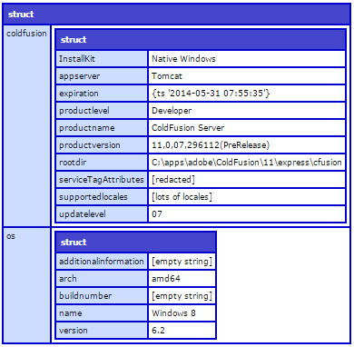

# Housekeeping #

## 0 ##

First things first: why is this chapter 0? Mostly because the stuff here is nothing to do with learning CFML, it's just the usual wittering on one gets at the beginning of a book. Skip as much of it as you like, but the last section covers getting the development environment I'll be using in the code example sorted out.


## Why? ##

Why am I writing this book? Good question. Basically I think CFML has moved on faster than most of the the learning materials out there have, and those materials are teaching a very old-fashioned way of approaching CFML-written applications. They probably do our community more harm than good by encouraging bad, primitive coding practices. I figure if I take a contemporary approach it will encourage everyone - existing CFML developers and newbies alike - to move on.


## What issues am I addressing? ##

For too long, CFML code was approached from a web-page-centric and tag-based-code-centric perspective. This was fine in 90s and earlier part of this century, but time has moved on, so has CFML, and that approach amounts to "bad practice" these days. You will be learning CFML using almost entirely script syntax, relegating tags to the section on views. In earlier versions of CFML one did still need to fall back to tag-based code for business logic code rather than just view code, but this has not really been the case for a few years now. It's time to accept this.


## CFML? Tags? Script? Huh? ##

The previous paras perhaps won't mean much to someone who is completely ignorant of CFML. But then again I doubt anyone who is completely ignorant of CFML will be reading it. If you are... at least go read the Wikipedia page on CFML (http://en.wikipedia.org/wiki/ColdFusion_Markup_Language) to get a handle on its history and general information about it.  This is not a history book, so I'm not covering that stuff. Except for a bit of context, a few paras below.

As it currently stands, CFML is a web-centric, loosely and dynamically typed language aimed at developing web-based applications and web sites. It arrived on the scene around about the same time as PHP, so it's one of the founding members in that space.

Typical CFML code looks similar to most "curly-brace" languages:

```
name = "Zachary";
writeOutput("G'day #name#"); // G'day Zachary
```

In this example I demonstrate setting a variable `name`, and outputting as part of an interpolated string, resulting in *G'day&nbsp;Zachary*

Most CFML code should be written using this "script" syntax, however CFML also has a tag-based syntax used in view files. The equivalent tag-based code for the above example would be:

```
<cfset name = "Zachary">
<cfoutput>G'day #name#</cfoutput> <!--- G'day Zachary --->
```

It has a resemblance to HTML, and is designed to integrate and intermingle with inline text such as HTML within a view file.

The language is processed by a Java servlet running on Tomcat or JBoss or some other servlet container, which compiles CFML source code to Java byte code, and executes it. This all happens when a request is received by a web server, and the web server has been configured to pass requests to the servlet container and onto the CFML servlet. The CFML servlet works out what code it needs to fulfil the request, compiles it, runs it, and returns any generated data (say: HTML or JSON) to the web server. The web server then sends that back to the client browser to do with it what it will.

It's important to note that CFML is a language, it is not a servlet in itself. At present, there are two main vendors who provide a CFML-processing servlet: Adobe and Lucee.

Adobe has a closed-source, paid for product - ColdFusion -  which is aimed at the enterprise market. Adobe inherited the ColdFusion product from their purchase and subsumption of Macromedia; Macromedia had previously done the same thing to Allaire, the original creators of "Cold Fusion". ColdFusion is not a flagship product of Adobe, and it has mostly been languishing in one of their backwater development departments since it became an Adobe product. It does seem occasional development, but the impression I get is that Adobe only persist with ColdFusion whilst the client-base they purchased as part of Macromedia continue to pay their licence renewals. ColdFusion is currently at version 11. Adobe release a new version of ColdFusion every couple of years. In the interim they will release one or two service packs for the currently-supported ColdFusion releases (only versions 10 and 11 are currently supported; support for version 9 ended at the end of 2014).

Railo was a company who lead the Railo open source project. The Railo solution was free and open source, and was more actively developed than ColdFusion. In its early days Railo was positioned as a free alternative to ColdFusion, and definitely positioned itself in ColdFusion's larger shadow.  Because it was an open source project, Railo is continuously releasing new version of the language, both adding new features and fixing bugs.

Whilst I was writing this the Railo project basically ended, and was replaced by Lucee. The reasons for this are outwith the remit of this book.

Lucee is currently on version 4.5. Note that the ColdFusion version number and the Lucee version number bear no relation to each other (this is sometimes confusing).

There is another CFML-esque implementation: Open BlueDragon. I mention that only for completeness: it is mostly irrelevant these days, and this will be the only mention of it in this book.

For many years the ColdFusion product was the only CFML servlet available, hence sometimes "ColdFusion" is used to mean "CFML". However ColdFusion is a servlet (well: a bunch of servlets, re-licensed third party Java libraries and an administration UI), and CFML is the language. This book is about the language CFML, not about ColdFusion. However in this book I will be using ColdFusion 11's implementation of CFML for my code examples. Where possible I will use code that will run on both ColdFusion 11 and Lucee 4.5. I will mention vendor differences only when it's necessary for the example. I hope that one will be able to focus on the code and not worry about the vendor as much as possible throughout this book.


## Cameron ##

Who am I? I'm Adam Cameron and I've been a CFML developer since early 2000. Throughout most of that time, I have been solely a CFML developer, with just a smattering of JavaScript on the site. I have been an active participant in the CFML community for that long too: helping people with problems via various Q&A forums, helping Adobe on the ColdFusion Pre-Release Program, and also putting my oar in in the Lucee community too. I know CFML pretty well, and figure my take on it is possibly worth writing down. I primarily used ColdFusion (version 9) for my day job. I say "used" in the past tense as I now mostly work with PHP, but I remain part of the CFML community.


## You ##

I'm writing this from the ground up, so should be suitable for a newbie to CFML. I will kind of assume a certain pre-knowledge of programming terminology in places though. I also hope it'll be beneficial for existing CFML devs to read as well. Hopefully I can teach old dogs new tricks too. Or at least get them snarling in disagreement with me.


## 24 hours ##

Well... take that with a grain of salt. It's a cliched title, but it sets the scene as to the general approach I shall take. I am not going to time how long it takes to read and absorb each chapter, but I will be breaking sections down into bite-sized chunks. That said, you should probably assume the book-based part of the learning process might take an hour per section, but it's then over to you to actually learn it. One cannot learn anything from just reading a book, these pages are just information dissemination. It's up to you to then take that information and learn from it. The code examples will be minimal: you're expected to then write your own code and experiment sufficiently to become comfortably with it. As one of my tutors at polytech (back in the early 1990s this was) was wont to say "I'm not here to teach, you're here to learn".

Also I shall not be covering everything in CFML in this book. I will be teaching the syntax, data types, constructs, and elements of functionality sufficient to get you productive. This is not a reference (as some tomes tend to be), there is online documentation for that. There's also an awful lot of CFML that one simply doesn't need to know. There's perhaps 500 top-level functions in the CFML language, and I've probably not used half of them. And there's possibly 100 tags and you should only ever used about *a dozen* of them. Are the rest of them just faciliate bad practice. There is no value in knowing a lot of this stuff. There is also no value in teaching about them all, because a function is a function... once one knows how to use functions, one can then use the online docs to reference the rest of them.

Similarly stuff like generating images, PDF files, charts, what-have-you - all of which CFML has support for - is tangential to the core language, and I don't think there's any need to discuss that sort of thing here. I'm going to get you a good handle on the core of CFML, and that'll enable you to work the rest out for yourself.

I'm also not going to waste time discussing how to install (beyond superficially) or administer ColdFusion: this is already well documented by Adobe. I'm not going to discuss how to install a  database server: again, the vendors have done this. I'm not going to specifically discuss HTML, HTTP, or ColdFusion maintenance or security. None of that stuff has anything to do with the CFML language, and there are better resources around for all that stuff. I hasten to add this is all vital information for you to know, but it's not my job here to teach you it. This is about CFML. This book will cover enough to get you learning CFML, and no more. As I said: it's up to you to follow-up in those other areas by yourself.


## IDE? ##

You don't need one. I don't use one. All you need is a text editor, although one with CFML support might be helpful once you move on from just a few lines of code. For my coding at work I use [SublimeText](http://www.sublimetext.com/), with the [CFML plug-in](https://packagecontrol.io/packages/CFML). Whilst CFML needs to be compiled to run, this is all handled via the servlet, when the code is requested. It's transparent from your perspective: there is no build process or anything like that, and you never even see the compiled files. The servlet takes care of all that for you. All you need to do is save CFML code to a file, then use a browser to browse to it which will in turn result in the ColdFusion server doing everything else automatically.


## Running the code ##

To run the code you will need to download and install [ColdFusion Express](https://www.adobe.com/products/coldfusion-family.html#content-dotcom-en-products-coldfusion-family-bodycontent1-ttt-1).

### Installing ColdFusion Express ###

It's just a zip file. So unzip it somewhere. I usually unzip it in `C:\apps\adobe\coldfusion\11\express`, but I mostly have that level of isolation because I have a lot of different CFML installs from various vendors running at once (eg, I also have  `adobe\coldfusion\11\enterprise`, `lucee\4.5`, `railo\4.2` all in that apps directory).

### File locations ###

Occasionally - like in the paragraph following this one - I will refer to files within the ColdFusion install directory. In my case, as per above, my install directory is `C:\apps\adobe\coldfusion\11\express`, and I will refer to paths relative to that like this: `[coldfusion]\some\path\here\'.

I will also occasionally refer to files in the web root. By default this is in `[coldfusion]\cfusion\wwwroot`. I'll refer to that as `[webroot]`. The web root can be configure to be anywhere, but that's outwith the scope of this discussion here. I'll discuss best practices for how to home files later (CHAPTER TBC).   

I'm afraid you *nix people that I am a perennial Windows user, so everything I do here will be Windows-centric, in the few situations it is relevant (which is hardly ever, in this book). You're a clever bunch so you'll be able to translate my Windows instructions to *nix ones. And if you can't: more fool you for using *nix ;-)

### Running ColdFusion Express ###

1. start a command prompt.
2. execute `[coldfusion]\cfusion\bin\cfstartup.bat`
3. that'll start spewing a whole lot of bumpf out on the screen, which should culminate in something like this, eventually:

```
INFO: Server startup in 15223 ms
```

(This laptop is old and slow, so hopefully yours will be a bit faster than that).

Note it might not be the last thing that displays, you're likely to get an error about `PDFgServlet`, but don't worry about that. It's related to a ColdFusion feature we'll not be needing for our purposes, and it's indicative of anything going wrong anyhow.

By default, the web server ColdFusion Express runs listens on port 8888, so the best way to check if ColdFusion is up and running is to browse to http://localhost:8888/CFIDE/administrator. If that presents a login screen: you're up and running. If it gives an error, then you have some troubleshooting to do: go to Google. Well: before going to Google, the CLI might have output an error for you, so grab that and google it. This book is not about troubleshooting ColdFusion installs, and there's stacks of resources out there to cover this, so it should be easy enough to get it.

If ColdFusion is up and running, you can quickly test your install by doing this:

1. create a text file containing this code:

```
<cfdump var="#server#">
```

2. Save it as `[webroot]\serverDump.cfm` (or save it within a subdirectory if you want to organise stuff better: up to you). All basic CFML script files should be saved with a .cfm extension.

3. browse to http://localhost:8888/serverDump.cfm. You should get something like this:



(I've excised some stuff from that, but you get the idea).

4. If you see something like that: you're good to go.


### Running the code in this book ###

In general, to run CFML code: save it in a file, and then browse to the URL of that file. There's more to it than that, but for the purposes of running some code examples: that's enough knowledge to work with.

The code samples in this book *might* be complete enough to simply copy and paste into a file, save it, and browse to it to see the results, but I make no promises in this regard. A lot of teaching material falls over itself to provide self-contained code examples so that that approach works all the time. This engenders a bit of laziness on the part of the person doing the learning, so I'm not going to make a point of encouraging that laziness. You're reading this to learn CFML, so this will mean active effort on your part, which might mean giving some thought to earlier material to write code which will set the ground work for a given code snippet to work. Now... I will *attempt* to make the examples stand-alone, but this won't always be the most expedient way to get the point across, so... well... be warned. Some effort on your part to facilitate your own learning might be require here. In general one learns by *doing*, not simply reading, or not simply by following instructions. I'm doing you a favour here, really. Honest. 

One thing I will try very hard not to do is to require you to flick *forward* in the book to understand something. All code examples should only ever build on what you've already done. I will however assume that once I've said / demonstrated something that you've taken the time to remember / understand it.

Also for any given code example, I reckon you're well placed to mess around with it a bit to try different variations of what I demonstrate, and see what happens: understanding the variations of how code can work is gold when understanding it. I will also presuppose you will take it upon yourself to RTFM on any statement, function, tag etc I mention. As I said earlier: this is a not a reference... the docs are for that. You need to read the docs. You. Need. To. Read. The. Docs. Also I'll deal with general programming concepts which are not specific to CFML. Go read up on those too. EG: when I talk about `switch` statements in the [Flow control structures](02-flow_control.md) chapter, go read what Wikipedia has to say about [switch statements](https://en.wikipedia.org/wiki/Switch_statement). It's really worth properly *understanding* these concepts.

## OK... ##

... let's get on with it.
