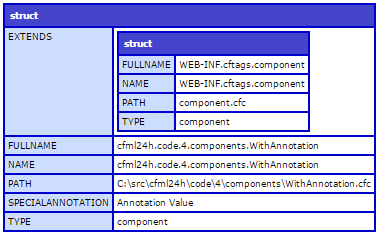

# OO with CFML #

## Object orientation, but quickly ##

Object oriented (OO) principles are pretty much outwith the scope of this book - other than discussing the basics - I'm going to assume you either already know about OOP, or will find out off your own bat. This book is about CFML, not about all the various other theoretical concepts one needs to have under one's belt to be able to use CFML.

CFML provides a bunch of basic data types as discussed in [Built-in types](03-types.md): strings, dates, arrays, structs etc. All of these are implemented as objects which have properties (ie: values) and methods (ie: functions which perform actions). This is basic object orientation at work.

I'll quickly run through some terms though.


### Class (/component) ###

A class is the definition of some data and some behaviour that that data has to represent an object of some description. For some reason in CFML classes are called components, but I think that's pretty poor and slightly misleading nomenclature, so I'll stick with the term "class" in this text.

In CFML, for all intents and purposes, a class is all the code within a CFC file (ie: a file with a .cfc file extension, eg: MyClass.cfc). In some languages classes have runtime manifestations (eg, Java has a class [java.lang.Class](http://docs.oracle.com/javase/8/docs/api/java/lang/Class.html), and one can instantiate Class objects and call methods on them). One cannot do this in CFML. So just think of the class or the component as the code that represents it. It does not really have any runtime representation.

Classes comprise properties and methods (see below).

Pretty much all code except for views (see [MVC basics](12-mvc.md)) should be implemented as classes.


### Object ###

An object is a runtime instance of a class. A class defines how a given type of object works, then one creates instances of that class as objects, which we then use in our code. A Person class might define that a person has a `firstName` and a `lastName`. And object is a realisation of this for a given person, eg an object representing "Peter Quint" is created with a `firstName` of "Peter" and a `lastName` of "Quint".


### Property ###

A property is a characteristic of an object: basically a data value that the differentiates between one object of a given type and another one. EG: a Person class might have `firstName` andd `lastName` properties defined. A given Person object might have a `firstName` property value of "Rohit" and a `lastName` of "Sharma". A second person might have a `firstName` of "Tony" and `lastName` "Underwood". One can think of properties as variables, really.

Unlike other languages, properties are only private in CFML. There is no concept of a public property. Properties must be accessed via accessor methods.


### Method ###

A method describes some behaviour of an object. Methods are implemented as functions. An example method for a Person object might be `getFullName()` which might return the firstName property value followed by the lastName property value, both separated by a space (eg: "Victor White").

Unlike other languages, CFML has only object methods, not class (or static) methods.


### Constructor ###

The constructor method is called when a new object is created. This enables values passed to the constructor to be used to set the initial state of the object. In CFML, the default constructor method is `init()` (but this can be overriden; see below).

### Pseudo-constructor ###

This is an odd idiosyncrasy of CFML. Code in a class definition which falls outside any method is executed when an object instance of the class is created. This is kind of like a constructor (and predates CFML having constructors), but has the drawback that it cannot receive any input arguments. In general, don't use the pseudo-constructor construct; just use the constructor.


### Accessors ###

These are methods that simply access property values: either to simply return their values, or to set them (sometimes referred specifically as "mutators", but that's perhaps taking the jargon unnecessarily far).  Accessors are convenient, but they should be used sparingly. Their usage does possibly indicate bad class design (see "Encapsulation" below, and the [Clean Code](08-clean-code.md) chapter.


### Method Access ###

Methods can have differing access restrictions:

* `public` methods are called on an object itself, from the calling code. For example `somePerson.getFullName()`.
* `private` methods can only be called from which the class's own code. They are not accessible to the code that created the object instance. A private method can be accessed from the class's own code, or any class that extends the class that defines the private method. IE: a subclass can access its parent or other ancestor class's private methods. This is slightly different from other languages in which `private` methods are only accessible from the class that defines said method.
* `package` methods can be accessed from any class that is homed in the same package (in CFML this is just based on the directory the class is defined in, or one of its subdirectories).
* `remote` methods can be accessed directly via HTTP requests made to the class file, using syntax http://example.com/path/to/SomeComponent.cfc?method=nameOfMethod.

Note that CFML doesn't have the notion of `protected` methods. Well it does, but it misuses the term `private` to reflect the same thing other languages would use the notion of `protected` for. In reality, it does not actually have the concept of truly `private` methods in the sense other languages might have, ie: methods only available to the exact class that defines them, and no others.

As touched on above, CFML does not have different access levels on properties. They are all `private` (using the CFML meaning of `private`, not the commonly accepted usage of that word).


### Inheritance ###

If one class would represent a "fine-tuning" or a more precise or specialised implementation of another class, then it could be made to `extend` that parent class. This enables code to have class hierarchies. For example there might be a Shape class, which is extended by a TwoDimensionalShapre class, which is extended by a Triangle class. Or the situation might be that a Manager *is a*n Employee, which *is a* Person: in this case Manager would extend Employee, which would extend Person. This allows the more specialised classes to still share behaviour (properties and methods) of their "base class".

CFML only supports single inheritance.


### Overriding and overloading methods ###

A parent class might implement a method for a broader solution than the requirement that a subclass might need. A Person class might define the `getFullName()` method as returning "#firstName# #lastName#", whereas for a subclass of Person - Employee - might instead need to define `getFullName()` to return "#lastName#, #firstname#". In this case Employee implements its own `getFullName()` method which *overrides* the parent class's equivalent method.

In a strongly typed language it's possible to implement same-named methods which accept different combinations of argument types. This is method *overloading*.  Because CFML is both loosely typed and implements variadic methods (ie: they can take a variable number of arguments), it would be difficult to implement method overloading reliably, so it doesn't bother.


### Interfaces ###

Classes can implement *interfaces* which allow allow type-checking on partial behaviour. Interfaces allow a kind of multiple inheritance, where a class is made to "implement" and interface, which means it will definitely have a certain subset of methods to describe a certain behaviour. For example a class might be "Iterable" (it can be looped over, say by implementing a `next()` method, etc) or "Comparable" (implementing an `equals()` method).


### Polymorphism ###

If class - Manager - extends class Employee which then extends class Person, then anywhere a Person is needed, a Manager object is valid, because whilst being a Manager, it is *also* a Person (and an Employee, for that matter).

Similarly, say a `sort()` method expects an array of `Comparable` objects (ie: they implement the `Comparable` interface), then it doesn't matter what actual class the objects are, provided they implement the `Comparable` interface.

This ability to use more specific types of object in situations calling for a less specific kind of object is "polymorphism".


### Encapsulation ###

One driving concept of good OO is that a given class - well its methods really - only ever works with:
* exitsing property values within an object;
* other variables internal to an object instance representing the state of the object;
* argument values passed into methods that act on properties or other variables.

Basically the idea is that the code in a class should only work with values defined by its own code (or code in ancestor classes, in the case of inheritance). A class defines a public interface (ie: its public methods), and that should be the only way any values can be passed into an instance of that class.

The reason for this is that if a class directly accesses materiel from its calling code's context then the class can only really operate in that specific situation, and can't easily be reused elsewhere. A class *should* be usable in any context, and not rely on the state of any calling context.

Encapsulation extends beyond that. Often times a class will be implemented with accessors for all its properties, and calling code will apply additional logic to those property values, having extracted them from the object they originally came in. *Sometimes* this is OK, but generally this suggests that the class's design is incomplete (or "anaemic") because external code is necessary to apply all the necessary logic to the properties. There's a balance to be made here, but alarms ought to go off whenever one is accessing an object's properties by accessors which simply get the raw property value.

### Common OO concepts CFML doesn't implement ###

* Multiple inheritance
* Method overloading
* Mixins or traits
* Abstract classes or methods
* Class or static methods or properties
* Destructors
* Final classes, methods or properties

### Summary of OO terms ###

That was rather less brief than I initially meant it to be. And sorry for not having shown even a single line of code so far in this chapter!

There is an endless number of OO terms out there which I have not mentioned here, one way or the other. But I've covered the ones that are important to CFML, and made it clear which common concepts CFML doesn't implement.

CFML's OO implementation is reasonably fully-featured when considering the requirements and behaviour of dynamic languages, compared to the usually more rigid language rules of more staticly typed languages which might benefit from some constructs that CFML simply doesn't need.


## Components ##

A class is defined via a CFC file (**C**old**F**usion **C**omponent). Only a single class can be defined per file, and the class definition is the only code allowed in the file. This is as opposed to other languages which allow multiple classes to be defined in a single source code file, and other procedural code to also reside in the same file.

The syntax for defining a class is:

````cfc
component {
	
}
````

One does not need to specify the name of the class as it's inferred from the file name.

A class definition can have a number of modifying attributes which are specified as name/value pairs similar to how an HTML tag might specify attributes, eg:

````cfc
component extends=ParentClass implements=SomeInterface {
	
}
````

It's slightly unorthodox to have to specify the `=` in there, but this is because one can specify any sort of metadata in the component declaration, and the only way the compiler can work out what's an attribute and what's its value is by having the syntax `attribute=value`, eg:

````cfc
component specialAnnotation=annotationValue {
	
}
````

If the value has embedded spaces, one needs to quote it:

````cfc
component specialAnnotation="Annotation Value" {
	
}
````

This sort of metadata can be used in any way. Often development frameworks will use annotations for special bespoke extensibility. The metadata can be fetched by calling `getMetadata()` on an object:

````cfc
object = new WithAnnotation();
writeDump(getMetadata(object));
````

Which will yield something along the lines of:



(see the bespoke metadata as that penultimate entry there).


