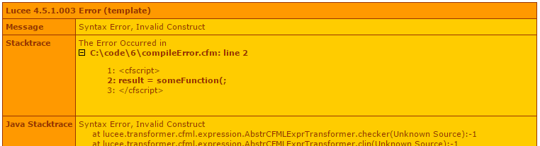
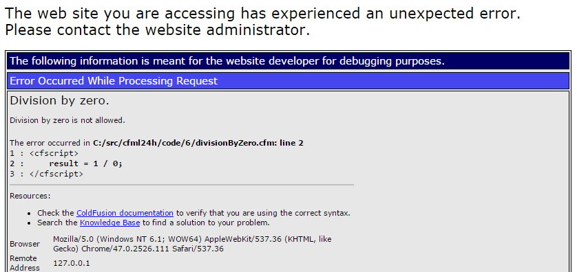
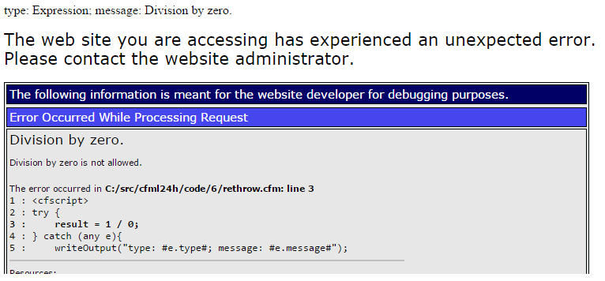
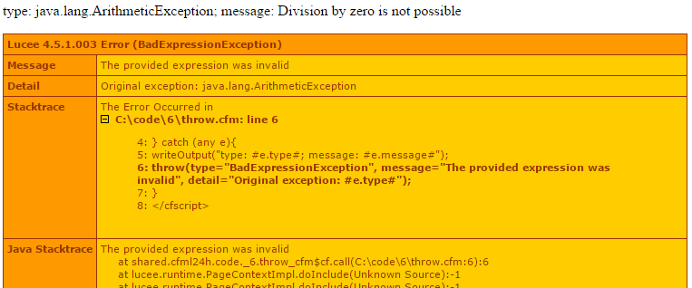

# Error handling #

I touched on exception handling before, but only in the context of how exception handling impacts flow control, rather than really going through the concepts behind it.


## Errors happen ##

Code will error. That's the first thing to accept... there's no such thing as bug free code (one can come up with trite examples to the contrary, but you know what I mean), and we just need to deal with bugs as they occur. But also sometimes is a fairly "logically sound" piece of code, things still go wrong, and whilst in some situations it's not reasonable to expect a problem so no reason to really try to code defensively around it, there are other situations in which it's more easy to predict that something will go wrong. These situations generally revolve around interactions with external systems rather than your own code. External systems are things like remote web services, third-party APIs, the local file system and... humans. These things all conspire to make our code break. Our code should deal with predictable systems by coding so that errors are not likely to occur - and errors that do occur are probably bugs - however when dealing with external systems one should only code an application to "work" for predictable inputs and outputs, and when unpredictable events happen - exception circumstances - the best way to handle it is to expect it to break, and pick up the pieces carefully once it's done so. This is exception handling.

Another completely legitimate scenario is to handle an occurrence from some external system (say: user input), expect it to be unreliable, intercept an error situation and as part of dealing with that situation either allow the error to bubble back to the user, or bubble a different error to the user.

I'm a big believer in "garbage in / garbage out": if my code receives duff inputs or other behaviour from an external system, don't try to work out what might have been meant, just throw an error back.

But before getting too entrenched in "what to do", let's look at how to do it.

We might have some code:

````cfc
result = runSomeProcessThatReliesOnAnExternalSystem();
````

We should always code defensively, which means the only code that we can trust is code that we wrote: our own application, basically. Defensive coding suggests that that line of code could error. If we let it error, then it's our fault. It we deal with it erroring, we've done out best, which is good enough.

Normally if the CFML server encounters something it doesn't like, it'll just error. If it's a runtime error, this means it will raise an exception, and halt. And all things being equal, you'll get an error on the screen.

However because it raises an exception before it halts, this gives our application code a chance to deal with the exception. We can catch it, inspect it, and decide what best to do with it. To catch an exception, we need to tell CFML we're on the look-up for exceptions to catch. We do this by "trying" to run some code:

````cfc
try {
    result = someExternalSystem.runSomeProcess();
}
````

This is syntactically incomplete, because as well as *trying* the code, we need to tell CFML what we're going to do with it once we've tried it. There are a couple of options, but we're just looking at catching whatever exception has been thrown first:

````cfc
catch (any e) {
    // do something here
}
````

To be clear, that's not syntactically complete either. We need to stick 'em together:

````cfc
try {
    result = someExternalSystem.runSomeProcess();
} catch (any e) {
    // do something here
}
````

I separated it out merely to get you to think about what's going on: we `try` some code; we `catch` any exception that tried code might throw.


## Digression: types of errors ##

I've perhaps not been as careful as I should be with my terminology here, but this is reflective of common usage. I will - no doubt - use the notion of "error" and "exception" interchangeably. This is unhelpfully vague. Errors come in various flavours, and not all of them result in exceptions. In CFML there are really only two types of errors to worry about: compile-time errors, and run-time errors.


### Compilation errors ###

Because there's no discrete compilation step in producing a CFML application, people often don't realise that CFML code is indeed compiled before it is executed. When you write code, it's not that actual code that runs. The CFML compiler compiles it to JVM-ready byte-code, and it's *this* that is executed. CFML uses a notion of "Just In Time" compiling. As a file is needed by your application, it's compiled. This is discussed more in depth in [Request/response process & scopes](chapters/09-request_response.md).

This is relevant in the context of errors because if code is not syntactically valid, then it can't compile, so CFML will throw an error. Here's an example:

````cfc
result = someFunction(;
````

Note that that code is malformed: it doesn't have its closing parenthesis. Syntax errors like this prevent the file from compiling, and yield a compile error:





This is not *particularly* clear that there's been a compile error, but if you see "syntax error", then it's a compile error.

Why is this important? Because compile errors occur *before the code can be run*. And to handle errors - to catch exceptions - we need to use code (ie: `try` / `catch`). And for code to be read, it needs to be run... and for it to run, it needs to be compiled first.

The ramification is that one can only use CFML's error handling to deal with *runtime* errors. It cannot deal with compilation errors.

We can't do this:

````cfc
try {
result = someFunction(;
} catch (any e){
	// deal with that syntax error
}
````


### Runtime errors ###

The only errors we can deal with are runtime errors: errors that crop up as part of the code running. This is a runtime error:

````cfc
result = 1 / 0;
````

`1 / 0` is not a valid expression bececause one cannot divide by zero: it's a mathematical impossibility. The CFML runtime will detect this, error, and as part of the error occurring, it will raise an exception. So we can `catch` that:

````cfc
try {
	result = 1 / 0;
} catch (any e){
	writeOutput("type: #e.type#; message: #e.message#");
}
````

This will result in this output:

````cfc
type: Expression; message: Division by zero.
````

But because this is a runtime error, we're given an exception to deal with, and our *code* can deal with it.


## Dealing with runtime exceptions ##

Oh, let's look at how that previous code runs *without* the `try` / `catch`:



So using `try`/`catch` the error still occurs, but instead of exiting, we are able to catch the exception, then do something. In my example I'm just outputing some info about the exception, but one can do whatever one wants there to deal with the situation as appropriate.

It's worth reviewing the `try`/`catch` section in the  [Control structures](02-flow_control.md#try-catch) chapter to understand the flow control of a the `try`/`catch` process, but basically it's

````cfc
// 1. this runs
try {
	// 2. this runs
	// 3. this errors
	// -. this does not run
} catch (any e){
	// 4. processing jumps to here
	// 5. etc
}
// 6. then continues on from here

````

So it's important to note that when one handles an error, then processing *doesn't* halt like it does when an unhandled error is encountered. So if one wants to handle some error condition, but then still halt processing: one actually needs to code for that. There are a few options here:

* rethrow the original exception - this will cause the same error condition again, and processing will stop with that error
* throw a *different* exception - this again will cause an error, but bubble up a different exception to code possibly handling it or listening for it.
* simply abort processing.


### Aborting ###

Here's an example:

````cfc
try {
	result = someExternalSystem.runSomeProcess();
} catch (any e){
	someExternalSystem.closeConnection();
	logger.logError("#e.type# #e.message# occurred when calling runSomeProcess()");
	abort;
}
````

This speculative example shows running some tidy-up code when the error occurs, then logging that it happened, but then simply aborting processing. `abort` simply says to the CFML engine "that's the end of that".


### Rethrow ###

Instead of the `abort`, we could use `rethrow` to cause the same error to be repeated. Going back to our earlier example:

````cfc
try {
	result = 1 / 0;
} catch (any e){
	writeOutput("type: #e.type#; message: #e.message#");
	rethrow;
}
````

Now we get:



So we get both the error handling code running, but then we just get the original error again.


### Raising new exceptions with `throw` ###

Or, similarly, we can cause a new error to occur, by throwing our own exception:

````cfc
try {
	result = 1 / 0;
} catch (any e){
	writeOutput("type: #e.type#; message: #e.message#");
	throw(type="BadExpressionException", message="The provided expression was invalid", detail="Original exception: #e.type#");
}
````




### Continuing ###

Now we don't *need* to halt processing either with an `abort`, or throwing an exception with `rethrow` or `throw`. As touched on above, processing will - by default - just continue on after the `catch` statement. Sometimes this is fine: the code that fails within the `try` / `catch` might be optional or "nice to have", and it's really no odds if it runs or not. Or it's more important that subsequent code still runs even if the optional "nice to have" code has failed.

An example might be that we have a booking system, and as part of the booking we log some metrics and send some emails. Whilst this info is excellent to capture, it's not essential... but what *is* essential is the booking goes through (and... err... we take the client's money ;-), and we show the user the booking confirmation page. So we might have this sort of code:

````cfc
try {
	metricsLoggingService.log(stuffToLogBeforeBooking);
} catch (any ignore){
	// if we don't get the stuff in the log, it doesn't really matter
}
bookingService.book();
try {
	emailService.sendPropertyEmail();
	emailService.sendCustomerEmail();
} catch (any exceptionFromEmail){
	try {
		// try to let our customers services team know they need to contact the proeprty and client cos they didn't get their emails
		emailService.sendCustomerServiceEmail();
	} catch (any ignore){ // "ignore" is not a special word, it's just a convention saying "I will not be using this exception object"
		// well we tried, but it's more important to give the customer a uniform experience
	}
}
try {
	metricsLoggingService.log(stuffToLogAfterBooking);
} catch (any ignore){
	// again, if we don't get the stuff in the log, it doesn't really matter
}
requestService.relocateToConfirmationPage();
````

Here we just use the `try` / `catch` to protect against optional code interfering with important code running. In some cases we simply don't mind if the optional code runs or not. In the case of the emails not being sent, we try remedial action (emailing customer services), but if *that* errors, "the show must go on", so we just keep going.

Our actual code handles this lot slightly differently, but it's a reasonable example.


## Causing exceptions ##

One might wonder if we've gone to all the effort of catching an exception, why then just throw it again, or throw a *different* exception. Fair question.

It's all down to separation of concerns, I guess (I sound vague as I'm trying to work out how to word it). There's various levels of code running in a given request. For example:

* a given web page's code...
* ... might call a back end API to get its data...
* ... which in turn calls a remote API or DB or something which stores the data.

The DB tier might error for a number of reasons: no connections, bad data, etc. This is important for the API to know, but the actual web app isn't interested in the minutiae of the data storage (that it's JDBC or ODBC or even that it's a DB), it's just interested in whether the API gives it objects back or not. So whether or not the API has remedial action to perform in these situations, if it wants to bubble back an exception to the calling code, then something specific to its own codebase rather than the vagary of the DB is more appropriate to bubble back. Say for example it might wrap up various different JDBC exceptions as one ApiStorageFailureException. That's the sort of thing the web page's code needs to know about. Not JDBC stuff.

In our situation we have the following set-up:

* the web site (eg: the files for the web pages themselves)
* an API that has all the business logic sitting behind that
* a payment service which is a wrapper for...
* ... a connection to the third party banking system

We use different banking providers depending on the situation, and each of those return different errors to us in different situations. One payment provider could have twenty different things that might cause a payment to be rejected or fail; or another system might only have half a dozen; each with different error codes and behaviours. But our *web site* only needs to know a couple of different variations: the payment was rejected (eg: dodgy credit card), or the payment couldn't be made (eg: comms error), because the website behaves differently depending on which of those it is. We don't want to have our website code needing to have handling for every payment provider's potential error situations. THis is the whole reason we have the abstracted API, after all! Or there might be some other sort of unexpected exception (a bug in our code, or in the payment provider, etc) which we don't want special handling for at all.

So our API handles each of the "expected" exceptions from the payment providers (they give us a list of all the possible errors), and catches those, then throws our own custom exception reflecting "PaymentRejectedException" or "TransactionFailedException", or "UnexpectedException". Then - no matter which payment provider we're using - the web site knows it only needs to deal with those three situations, with messages like:

* your payment didn't go through, please try again
* there was an error processing your payment, please try again
* or for the unexpected ones, just show the general error page


## Why let it error? ##

Another question that could crop up here is if I'm catching the exceptions, why do I think throw *another* exception, instead of "just dealing with it". I think we can agree that the exceptions from external sources like our payment provider are unavoidable, so we need to catch those. But why then cause *more* errors? The thing to remember here is that an error might raise an exception, but an exception is not intrinsically an error. Especially if one raises it on purpose.

Some code I have seen will try to hide exceptions from the calling code. It'll do this sort of thing:

````cfc
function someFunction(){
	var result = {};
	try {
		result.data = someRiskyFunction();
		result.status = true;
	} catch (any e){
		result.status = false;
		result.message = e.message;
	}
	return result;
}
````
So if `someRiskyFunction()` errors, we don't let the error perpetuate, we deal with it. We just tell the calling code whether things worked or not (via the `result.status` value).

Then in the calling code, do this:

````cfc
records = someFunction();
if (records.status){
	// it's OK
}else{
	// do something else to handle the fact it was no good
}

````

On the surface of things, this seems fine and it's "good" because there are no errors to deal with. However it's pretty much reinventing the wheel, and using a system-specific mechanism for doing so. The *rest of the industry* uses exception handling for this sort of thing.

If code didn't work: it's *OK* for it to error. Just deal with it.

I think this approach stems from developers getting it into their head that exceptions are somehow bad. They're not. *Not dealing* with errors are bad, but exception handling is there for effecting this. Writing code that errors in an uncontrolled fashion due to suboptimal logic? Also bad, but that's a different thing. Basically if code is supposed to do something, and it *doesn't do it*, then raising an exception is completely the appropriate and expected thing to do.


## Letting the correct code make the decisions ##

Another consideration here is that one ought to pay attention to which code should be responsible for dealing with error situations.

If code "hides" and exception, then it's taking responsibility to deal with it. And if the code in question is inside a method `makePayment()` (for example), then that's the wrong place to be dealing with it. It's not `makePaymentOrDealWithItIfItDoesntWork()`, so that function should not be dealing with it. It's function is to make a booking. That's it. If it doesn't make the booking, it's failed.

Also it's not for this Payments API to decide how to handle an error on my site. It's my site's job. This is presupposing that the entire site / application is compartmentalised into "areas of concern", which I'll discuss in the [MVC basics](12-mvc.md) chapter, but the `makePayment()` function should raise a relevant exception, and let the code that call it decide what to do with it. This should bubble all the way to the top level of the web site, where a given web page should deal with it (display a message or change the output somehow), or just filter all the way up to the site's default error page. If you look at things in the context of the entire web site rather than the immediate code that's raising an exception, it becomes easier to see that bubbling an exception back to the most appropriate code to deal with it makes sense.


## A closer look at an exception ##

We've seen that a `catch` block receives an exception object, eg:

````cfc
try {
	// risky code
} catch (any e){
	// do somethind with the exception
}
````

In this example, the code in the `catch` block receives a variable `e`, which contains the actual exception object. IE: the very object that was created to represent whatever error occurred.

An exception object has a number of properties which are exposed properly:

<table border="1">
<thead>
<tr><th>Property</th><th></th></tr>
</thead>
<tbody>
	<tr><td>Type</td><td>This is the type of exception, eg: ArithmeticException, IOException</td></tr>
	<tr><td>Message</td><td>A human-readable message describing the error</td></tr>
	<tr><td>Detail</td><td>More human-readable detail on the error</td></tr>
	<tr><td>TagContext</td><td>An array of code references: basically the call stack of code executing at the time the exception was created</td></tr>
	<tr><td>StackTrace</td><td>The Java stack trace at the time the error occurred</td></tr>
</tbody>
</table>

All property values are strings, unless specified.

Note that often exceptions will also have an `errorcode` and `extendedinfo` properties. These are not *always* included though. And various other exception types will expose other properties too.

One last note: the exception object variable is only available in its `catch` block. It is *not* available in code following a `catch` block.


## Throwing your own exception ##

Similarly, the `throw()` statement can create a custom exception (which was shown further up):

````cfc
try {
	throw(
		type = "SomeException",
		errorCode = "123",
		message = "This is an exception",
		detail = "And more detail on the exception",
		extendedinfo = "More info still"
	);
}catch(any e){
	writeDump(e);
}
````

That dump will show everything exposed by the `e` object.


One can also throw a Java exception too:

````cfc
throw(object=createObject("java", "java.lang.Exception").init("This is a Java Exception"));
````

Here the `type` will be `java.lang.Exception`, and the `message` `"This is a Java Exception"`.

Throwing a Java exception is handy when working with Java code that has returned the exception, and you want to `try` / `catch` it, then bubble it further up to the calling code. You'd probably not *usually* manually create the exception object to then throw, you'll just be bubbling back one you've already caught.

Remember you can also use `rethrow` in a `catch` block to... well... rethrow the exact same exception that the `catch` block caught.

## Dealing with different exceptions ##

On the other end of all these different exceptions, we can also catch precise exceptions too. So far we have only done this:

````cfc
try {
	throw(type="SomeException");
}catch(any e){
	// deal with any sort of exception
}
````

However we don't have to catch `any` exception, we can catch specific types:

````cfc
try {
	throw(type="SomeOtherException");
} catch(SomeException e){
	// this isn't run
} catch(SomeOtherException e){
	// this is run
}
````

In this example we're actively throwing a `SomeOtherException`, and we have `catch` blocks prepared to catch - respectively - a `SomeException` and a `SomeOtherException`. An exception can only been caught by one catch block.

Note that if the exception is different from any of the ones specified to be caught, it will *not* be caught, and the error will be thrown, eg:

````cfc
try {
	throw(type="ADifferentException"); // this exception will not be caught, so will cause an error
} catch(SomeException e){
	// this isn't run
} catch(SomeOtherException e){
	// nor is this
}

````


## Namespacing exceptions ##

Being able to catch various different exceptions is excellent, but what if one wants to have the same catch block for multiple different exceptions? This is possible too. One can "namespace" exceptions, and then `catch` exception types by namespace:

````cfc
try {
	switch (randRange(1,3)){
		case 1:
			throw(type="com.mydomain.myapp.SomeException");
		break;
		case 2:
			throw(type="com.mydomain.myapp.SomeOtherException");
		break;
		default:
			throw(type="DifferentException");
		break;

	}
} catch(com.mydomain e){
	writeOutput("com.mydomain exception caught: #e.type#");
} catch(any e){
	writeOutput("Any other sort of exception caught: #e.type#");
}
````

Here we are namespacing our exception by the standard reverse-domain name packaging tactic, throwing one of either a `com.mydomain.myapp.SomeException` or `com.mydomain.myapp.SomeOtherException` from that package: these will be caught by `com.mydomain`. one third of the time this test code will throw a `DifferentException`, and this will be caught by the `any` `catch` block.

Your namespacing doesn't have to follow any specific pattern, other than separating each element by dots. You can catch groups at any dotted partition (ie: in that example above, one could catch `com`, `com.mydomain`, `com.mydomain.myapp` or `com.mydomain.myapp.SomeException`).


## finally ##

I mean this in both the sense that this is the final section of this chapter, but also the `finally` functionality.

As well as having a `try` block and `catch` blocks, one can also have a `finally` block:

````cfc
writeOutput("Before the test code<br>");
try {
	switch (randRange(1,4)){
		case 1:
			writeOutput("Throwing a CaughtException<br>");
			throw(type="CaughtException");
		break;
		case 2:
			writeOutput("Throwing a RethrownException<br>");
			throw(type="RethrownException");
		break;
		case 3:
			writeOutput("Throwing a UncaughtException<br>");
			throw(type="UncaughtException");
		break;
		default:
			writeOutput("Not throwing an exception<br>");
		break;

	}
} catch (CaughtException e){
	writeOutput("Caught a #e.type#<br>");
} catch (RethrownException e){
	writeOutput("Rethrowing a #e.type#<br>");
	rethrow;
} finally {
	writeOutput("This is run irrespective of anything else going on in this try / catch / finally block<br>");
}
writeOutput("After the test code<br>");
````

This is a chunk of code, but it demonstrates that any of these situations will run the `finally` block:

* an exception is caught
* an exception is thrown (in this case via `rethrow`) in the catch block
* an exception that isn't caught at all
* no exception is thrown at all

One sitter for the `finally` construct is when doing file operations (which will be covered in [File system / HTTP / FTP](18-file_system.md)). It's always important to exception handle file system operations as what the file system does is outwith your control, and it's always important to *close* a file if you've opened one, irrespective of how the code runs:

````cfc
try {
	writeOutput("Open a file for reading<br>");
	f = fileOpen(getCurrentTemplatePath());
	line = f.readLine();
	throw(type="ForcedException");
} catch (ForcedException e){
	writeOutput("Deal with the exception<br>");
} finally {
	f.close();
	writeOutput("And the file is safely closed<br>");
}
````

As demonstrated in the previous example, whether this code runs fine or whether that exception is thrown (50% of the time), it doesn't matter: the `finally` block will run, and close that file.


## Conclusion ##

Exception handling is pretty comprehensive in CFML. One has to deal with exceptions when they arise; but also understand that it's OK for code to error if that's the most suitable thing for it to do. Don't "hide" exceptions: just deal with them.
